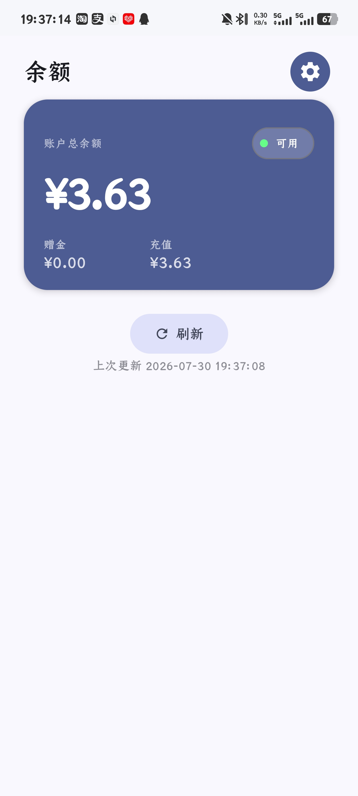
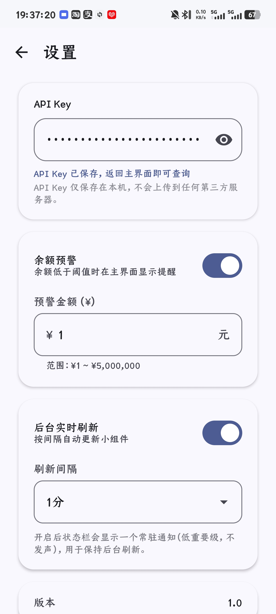

# DeepSeek 余额查询

一个轻量的 Android 小工具，用来查询 DeepSeek 账户的 API 余额（赠送额度 / 充值额度），并支持桌面小组件实时刷新，省去每次打开网页后台的麻烦。

## 功能特性

- **查询 API 余额**：实时获取账户总余额、赠送余额、充值余额（支持多币种，默认 CNY）。
- **桌面小组件**：一键添加到桌面，后台定时刷新，无需打开 App 即可看到余额。
- **余额预警**：设置阈值，余额低于设定值时给出提醒。
- **流畅体验**：锁定 120Hz 高刷新率，页面切换与滚动均做了性能优化（冷启动、滑动、动画全场景稳定不卡顿）。
- **本地配置**：API Key 仅保存在本机，不依赖任何云端账户。

## 界面展示

| 主界面 | 设置页 | 桌面小组件 |
|:---:|:---:|:---:|
|  |  |  |

## 应用图标


## 使用方法

1. 在 [platform.deepseek.com/api_keys](https://platform.deepseek.com/api_keys) 获取你的 API Key。
2. 打开 App，在「设置」页填入 API Key 并保存。
3. 返回主界面即可查看余额；如需桌面小组件，长按桌面空白处添加即可。

## 隐私与安全

本项目的设计目标是「**数据完全本地可控**」：

- **API Key 只存本地**：保存在 App 私有目录（`SharedPreferences`，仅本应用可读），不会上传到任何第三方服务器。
- **唯一的网络请求**：仅发往 DeepSeek 官方接口 `https://api.deepseek.com/user/balance`，用于携带 `Bearer` 令牌查询余额。项目内**没有任何**统计、崩溃上报或广告 SDK（无 Firebase / 友盟 / Bugly 等）。
- **可自行验证**：用抓包工具（如 HttpCanary、Charles）查看 App 流量，只会看到发往 `api.deepseek.com` 的请求，不会看到其他域名。

> 说明：当前 API Key 以**明文**形式存储于 App 私有目录（其他应用无权限读取）。若设备已 root 或通过 `adb backup` 导出，明文理论上可被读取。对安全性要求更高的用户，可将存储改为 `EncryptedSharedPreferences`（依赖已就绪，代码层面替换即可），此项可作为后续增强。

## 构建

环境要求：

- Android Studio（或 JDK 21+）
- `compileSdk = 35`，`minSdk = 24`
- Kotlin 2.3.21 / Gradle 9.4.1

构建 Release 包：

```bash
./gradlew assembleRelease
# 产物位于 app/build/outputs/apk/release/app-release.apk
```

> 默认使用 debug 签名以便本地安装测试；正式分发请自行配置签名。

## 开源

本仓库包含完整的项目源码。任何人都可以审阅 `app/src/main/java/com/deepseek/balance/network/ApiClient.kt`（网络请求）与 `MainActivity.kt` / `WidgetRefresh.kt`（存储逻辑），确认没有任何数据上传行为。
